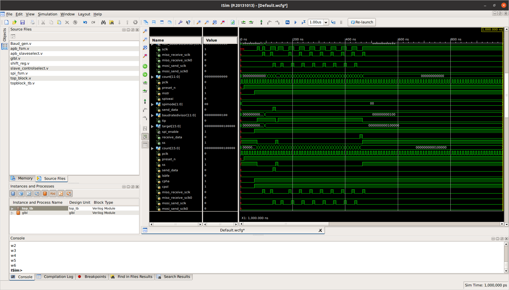

## 📌 Overview
Designed and implemented an APB interfaced SPI protocol controller in Verilog supporting configurable SPI modes (CPOL/CPHA).

## 🚀 Features
- APB Slave Interface
- SPI Master Communication
- Configurable SPI modes
- Baud rate generator
- Full-duplex data transfer

## 🧠 Modules
- Baud Generator
- APB Interface
- SPI FSM
- APB FSM
- Shift Register
- Slave Select Logic

## 📊 Simulation Result
The design was verified using simulation waveforms demonstrating correct APB transactions and SPI communication.

## 📷 Waveforms

## 🛠 Tools Used
- Verilog HDL
- Xilinx ISE Simulator

## 👨‍💻 Author
Sangeetha Krishnakumar
